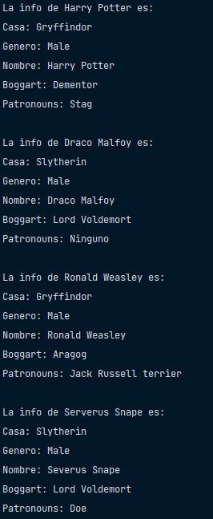
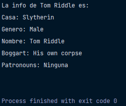
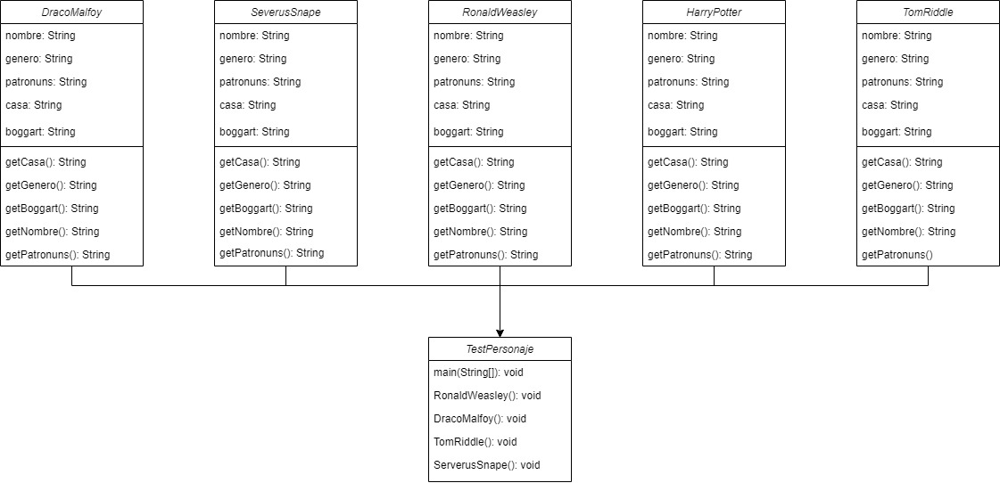
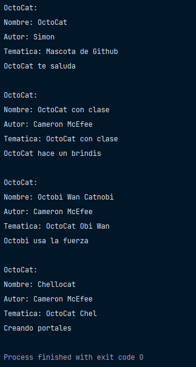
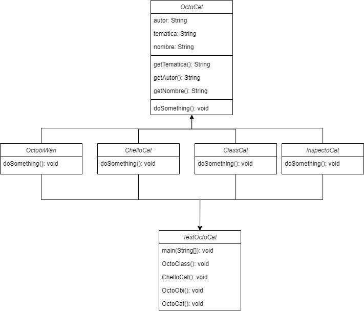
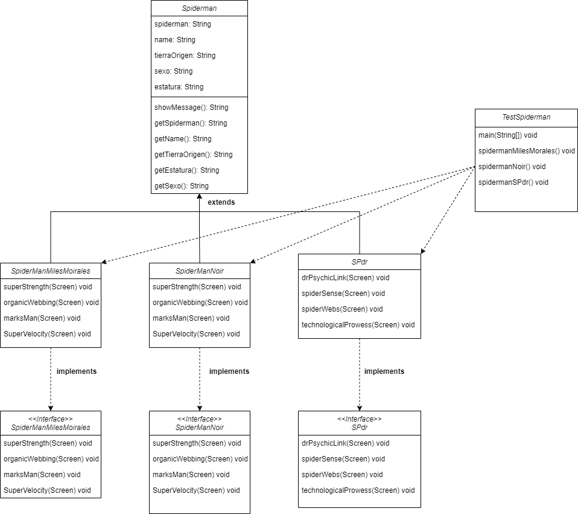
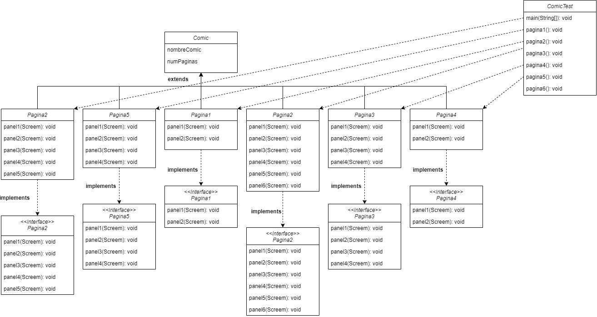

# BackEnd JAVA

BackEnd Java es un conjunto de ejercicios relacionados a los conceptos básicos
de la programación orienta a objetos.

## Ejercicio 1: Práctica Modelado

### Ejecución

### Diagrama

## Ejercicio 2: Práctica Herencia y Polimorfismo

### Ejecución

### Diagrama

## Ejercicio 3: Práctica Interfaces

### Diagrama

### Ejecución

 ## Ejercicio 4: Práctica Hilos

 ### Diagrama
 

### Ejecución
